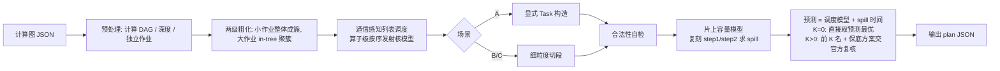
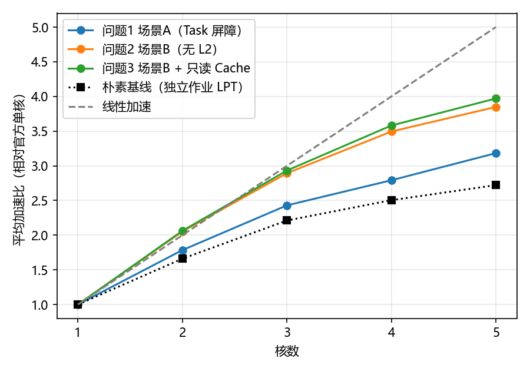
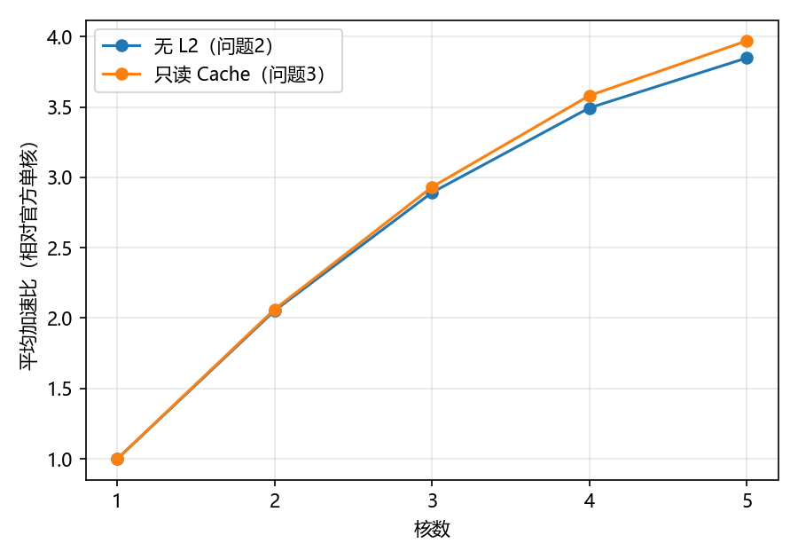
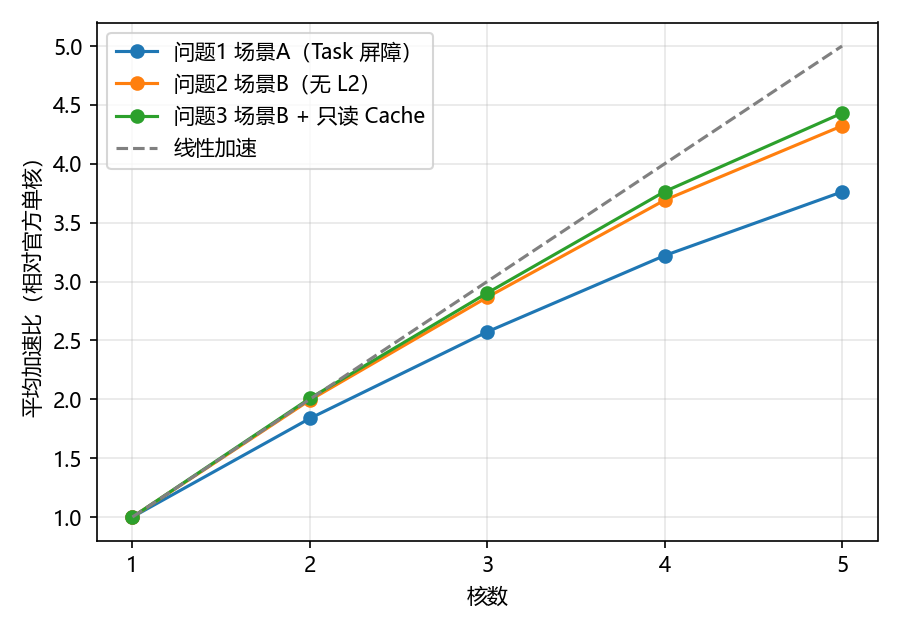

# A题 通用神经网络处理器下的多核切图与调度 —— 方案设计（初版）

> 本文件给出三个小问的完整建模思路、算法设计、正确性论证、初版实验结果和后续改进路线。
> 配套代码在同目录 `solver/`，所有结果都由**官方评估程序**计算，可直接复现（见第 10 节）。

---

## 0. 结论先行

**总体方案**：“两级粗化 + 通信感知列表调度（HEFT 变体）+ 代理模型（算子级调度模型 + 精确 spill 模型）选优 + 可选的官方评估复核”。三个小问共用同一框架，只在**代价模型**和**方案构造规则**上按场景区分：

| 小问 | 场景语义 | 核心设计 | 16 个代表用例 4 核平均加速比 |
|---|---|---|---|
| 问题1 | 子图 = Task，Task 级屏障（跨核 +1000、同核 +100） | 调度时**显式构造 Task**（加入/新建二选一 + 封闭规则），外加“限制 Task 规模”族候选以消除 spill | **2.79**（朴素基线 2.50） |
| 问题2 | 同核子图合并，算子级跨核依赖（COPY_OUT + 500 + COPY_IN） | **细粒度切段**固定核内执行顺序（发送簇后断段、接收簇前断段）+ DDR 局部性惩罚 | **3.49** |
| 问题3 | 问题2 + 1 MB FIFO 只读 L2 Cache（250 B/cycle） | Cache 感知代价模型 + 跨场景候选（问题2 方案也参与复核） | **3.58**（相对无 L2 平均 1.026×，最高 1.098×） |

5 核时三问平均加速比分别为 **3.18 / 3.85 / 3.97**（朴素基线 2.72）。按题目规定，单核加速比记为 1。所有用例、所有问题的 makespan 随核数单调不增；这是因为复核时上一核数的方案（补一个空核）也作为候选参与比较（3.5 节），不是列表调度本身保证的。

**全部 100 个用例**（只用模型选优，7.4 节）：5 核平均加速比 **3.76 / 4.32 / 4.43**；4 核问题2 平均 3.69，比“只做作业级分配”的理论上界 3.10（1.4 节）高 19%。这是模型选优后的官方成绩，不是“候选中经官方验证的最优”。经兜底比较（3.5 节）后，1500 个组合的 makespan 全部随核数单调不增；兜底前，模型选中的方案在问题1、2、3 分别有 15、8、6 个用例出现核数增加反而变慢。spill 模型在 1500 个方案上与官方逐字节一致。8 进程约 1.5 小时跑完，时间几乎都花在报告成绩所需的官方评估上。

代理模型除了估计调度时间，还**精确复刻了官方的 spill 计算**（3.4 节；627 个方案的 spill 字节与官方逐字节一致），所以不调用官方评估器也能可靠选优。只用模型时，240 个“用例 × 问题 × 核数”组合的平均 makespan 只比官方复核的结果高 0.8%，其中 180 个组合的结果与复核完全相同（7.3 节）。

求解耗时（10 进程并行时测得）：在这 16 个中小规模用例上，只用模型时每个组合平均 1.2 s、最长 8.1 s；含官方复核（K=2）时平均 5.4 s、最长 66 s。大图的瓶颈在官方评估器，不在算法本身：最大的图（3.57 万个计算算子）只用模型每个组合 25–53 s；而 case_025（1.86 万个算子）问题1、4 核、K=1 的求解连同复核约 6.7 分钟。对大图建议直接用模型选优（`--verify 0`），这也符合题目“单个用例以 5–10 分钟内给出结果为佳”的建议。

---

## 1. 题目理解：从官方评估程序中读出的关键机制

建模必须贴合官方评估器的真实语义，下面每一条都经过源码阅读和 trace 验证，并直接决定了算法设计。

### 1.1 执行模型

- 计算图是“算子–张量”二部 DAG。算子分为计算算子（MATMUL/CONV 走 `PIPE_M`，ADD/RELU/REDUCE 等走 `PIPE_V`）和搬运算子（`COPY_IN` 走 `PIPE_MTE2`：DDR→片上，`COPY_OUT` 走 `PIPE_MTE3`：片上→DDR）。
- 方案只需给出两样东西：`node_to_subgraph`（每个计算算子属于哪个子图）和 `core_schedules`（每个核按顺序执行哪些子图）。COPY 算子由评估器根据子图边界自动生成。
- 核内调度由官方三步完成：step1 逆向 DFS 定序、step2 Belady 式 spill 插入（L1 = 512 KB、UB = 128 KB）、step3 内存分配与复用依赖。
- **每条流水线按序发射、单槽（PIPE_SLOTS = 1）**。实测单核时 M/V 两条流水线的重叠很少：case_019 只用到可重叠量的约 19%，因为只要队头算子等待依赖，后面的指令就全部阻塞。
- DDR 带宽 60 B/cycle，由所有并发搬运**公平分享**。

### 1.2 三个场景的差异（决定建模方向）

| 机制 | 场景 A（问题1） | 场景 B（问题2） | 场景 C（问题3） |
|---|---|---|---|
| 执行单位 | 每个子图独立成 Task | 同核所有子图合并为一个 Task | 同 B |
| 跨子图依赖 | Task 级：前驱 Task 全部完成才激活 | 算子级：只等所需张量 | 同 B |
| 跨核代价 | 前驱 Task 结束 + 1000 | 源 COPY_OUT 结束 + 500 后目标 COPY_IN 才能发射 | 同 B |
| 同核代价 | 上一 Task 结束 + 100；跨 Task 张量经 DDR 往返 | 无额外代价 | 同 B |
| 图输入读取 | **每个子图各读一次** | 每个消费核读一次 | 同 B，但重复读可能命中 Cache |
| 核内顺序 | Task 内由 step1 DFS 决定 | step1 DFS 序再按子图在 `core_schedules` 中的名次稳定排序 → **子图粒度决定核内顺序** | 同 B |

### 1.3 实验中发现的“隐藏”机制（本方案的主要发力点）

1. **场景 B 的跨核发送落在源子图末尾**。step1 把 COPY_OUT 汇点压在 DFS 栈底，它们在原始序列中出现得很晚，按子图稳定排序后就排到了**所在子图的最后**。结果是生产者算完之后，还要等整个子图跑完才发送。初版方案这一项让 case_050 的 4 核 makespan 多出约 20%。
2. **跨核 COPY_IN 放在“最早消费子图”内、紧挨消费者之前**，而 MTE2 按序发射：一个等待远端数据的 COPY_IN 会堵住它后面所有的搬入（队头阻塞）。
3. **场景 B 中每个（源核, 目标核）对各自生成一对 COPY_OUT/COPY_IN**。广播给 3 个核就要写 DDR 3 次，所以跨核流量会迅速逼近共享 DDR 带宽。case_050 的新增搬运约 1.3 MB，相当于约 2.2 万周期的满带宽。
4. **官方单核基线本身可能被 spill 拖慢**。例如 case_044 单核额外换入换出 4.44 MB，L1 峰值打满；而细粒度子图能固定一个低工作集的执行顺序，spill 降为 0。这是出现“超线性加速”的原因，完全在规则之内。同样的机制让 1 核时重新切分也能得到比单核基准更短的 makespan；但题目规定单核加速比为 1，这类结果只作为附加实验报告，不计入加速比。这种情况并不少见，见 1.4 节的内存压力统计。
5. **问题3 的 Cache 规则**：只有 COPY_IN 完成时才插入；命中要求此前已有同一逻辑张量的 COPY_IN **完成**（同时发起的读取全部未命中）；FIFO 淘汰，命中不刷新顺序；大于 1 MB 的张量不缓存。键是片上张量的逻辑 id，所以不同核读同一个共享输入、同一张量广播到多个核、spill 后回读，都可能命中。

### 1.4 数据画像（100 个用例）

- 规模：约 550～35700 个计算算子；约 86% 的中间张量只有 1 个计算消费者；每个算子至多 2 个输入；没有算子到算子的直连边，每个张量只有一个生产者。
- **内在并行度**（总计算量 / 关键路径）：最小 3.4（case_048），10% 分位 9.9，中位数 43。也就是说几乎所有用例在 5 核以内都有足够的并行空间，**难点在通信和屏障代价**，而不在并行度本身。
- 按弱连通分量拆成的“独立作业”：若只做作业级 LPT 分配，4 核平均加速比的理论上界只有 3.10。有 26 个用例存在占总计算量 50% 以上的超大作业，必须把作业内部切开。
- **内存压力**（用 3.4 节的 spill 模型统计，全量实验中的官方单核评估也确认正是这 40 个）：40 个用例的官方单核基线存在 spill，最多的是 case_028（277 MB）和 case_067（264 MB）。把 spill 字节按满带宽折算成时间，超过总计算周期 20% 的有 6 个：case_044（88%）、case_090（39%）、case_073 和 case_092（27%）、case_083（26%）、case_046（23%）。这类用例的瓶颈是片上容量，不是并行度。

---

## 2. 统一数学模型

### 2.1 符号

- 计算图 $G=(O\cup T,E)$，计算算子集合 $O_c$；算子 $v$ 的流水线为 $p_v\in\{M,V,\text{MTE2},\text{MTE3}\}$，周期为 $c_v$；张量 $\tau$ 的大小为 $s_\tau$。
- 收缩 COPY 算子后得到计算 DAG $D=(O_c,A)$：$(u,v)\in A$ 当且仅当 $v$ 消费 $u$ 产出的中间张量。
- 核数 $N\in\{1,\dots,5\}$，DDR 带宽 $\beta=60$ B/cycle。

### 2.2 决策变量

- 子图映射 $\sigma:O_c\to\{0,\dots,S-1\}$；
- 核分配 $\kappa:\{0,\dots,S-1\}\to\{0,\dots,N-1\}$；
- 各核的子图执行序列 $\pi_k$（$\kappa^{-1}(k)$ 的一个排列）。

### 2.3 约束

- (C1) 覆盖与唯一：每个计算算子恰属于一个子图；每个子图在 `core_schedules` 中恰好出现一次。
- (C2) 商图无环：$Q=\big(\{0..S-1\},\ \{(\sigma(u),\sigma(v)) : (u,v)\in A,\ \sigma(u)\ne\sigma(v)\}\big)$ 为 DAG。
- (C3) 无死锁：$Q\ \cup\ \bigcup_k\{(\pi_k[i],\pi_k[i+1])\}$ 仍为 DAG，即核内顺序与数据依赖相容。
- (C4) 片上容量：任意时刻各核 L1/UB 的驻留量不超过容量（由官方 step2 插入 spill 保证，但 spill 会产生额外搬运和时间）。

### 2.4 时间语义（按场景）

- **场景 A**：Task $j$ 的激活时刻
  $$r_j=\max\Big(e_{\text{prev}(j)}+100,\ \max_{i\in\text{pred}(j),\,\kappa(i)\ne\kappa(j)}\big(e_i+1000\big)\Big)$$
  其中 $e_{\text{prev}(j)}$ 是同核上一个 Task 的结束时刻，每个核的首个 Task 取 0。Task 内部按 step1–3 执行，边界输入逐 Task 重读，跨 Task 输出经 COPY_OUT 写回 DDR。
- **场景 B**：跨核张量 $\tau$ 从核 $a$ 到核 $b$，满足 $\text{start}(\text{IN}_b(\tau))\ \ge\ \text{end}(\text{OUT}_a(\tau))+500$。
- **搬运时长**：独占 DDR 时为 $\lceil s_\tau/\beta\rceil$；有 $n(t)$ 个并发搬运时，每个分到 $\beta/n(t)$。
- **场景 C**：COPY_IN 若在发射时命中 Cache，时长为 $s_\tau/250$，走独立的 CACHE_READ 带宽池。

### 2.5 目标函数

$$\min\ T_{\text{make}}(\sigma,\kappa,\pi),\qquad
\bar S_1=1,\quad \bar S_N=\frac{1}{|\mathcal C|}\sum_{c\in\mathcal C}\frac{T^{(1)}_c}{T^{(N)}_c}\ (N\ge 2)$$

目标只有 makespan。题目把总额外数据搬运量 $\Delta B$ 列为次要指标，Cache 命中率 $h$ 用于观察。本方案选优时只比较 makespan（模型预测值或官方值），不把 $\Delta B$、$h$ 作为并列目标：$\Delta B$ 由构造阶段的 in-tree 聚簇和局部性惩罚 $\lambda$ 间接控制，$h$ 只报告；两者都逐用例列在附录表中。$T^{(1)}_c$ 是官方 `singlecore_evaluate.py` 在整图上给出的单核 makespan。按题目规定，单核加速比为 1；1 核时重新切分得到的 makespan 只作为附加实验（1.3 节第 4 条）。

### 2.6 复杂度

即使忽略全部通信、令所有算子彼此独立，问题也退化为 $P\|C_{\max}$：$N=2$ 时可由 PARTITION 归约，是 NP 难的；$N$ 作为输入时是强 NP 难的。再叠加 DAG 依赖、按序流水线、带宽共享和 spill，精确求解不可行。因此采用“构造式启发 + 代理模型选优（可选官方复核）”：每个问题只生成 9–12 个固定候选，不做迭代搜索，这也符合题目“避免暴力迭代”的要求。

---

## 3. 总体算法框架（三问共用）



### 3.1 两级粗化

1. **作业级**：按中间张量的弱连通性把计算 DAG 拆成独立作业。计算量不超过 $\rho\cdot W/N$ 的作业整体作为一个簇，不再拆分（$W$ 为总计算量，$\rho$ 为参数 `split_ratio`）。
2. **簇级（in-tree 聚簇）**：大作业内部按逆拓扑序处理。算子 $u$ 若恰有一个计算消费者 $v$、且不输出到图外，就并入 $v$ 所在的簇，簇计算量上限为 $W/(N\cdot g)$（$g$ 为参数 `grain`）。这样每个簇是一棵以“根算子”为出口的依赖树，簇内部按 DFS 执行时工作集很小。
3. **粒度自适应**：in-tree 合并可能把并行分支并进同一个簇。典型的是逐级“分叉–汇合”的长链。case_016 约 305 级，每级 12 条并行分支汇合到 1 个算子，再广播给下一级；98% 的算子出度为 1，于是每一级整个并成一个簇，簇图退化成一条链，所有方案都只能放在一个核上（加速比 1.00）。为此比较簇图并行度 $P_c=W/\mathrm{CP}_{\text{簇图}}$ 与算子级并行度 $P=W/\mathrm{CP}$：若 $P_c<0.75\cdot\min(N,P)$，就给该候选追加粒度 $4g,16g,\dots,4096$ 的版本，由模型挑选。100 个用例中只有 case_016、case_024、case_051 触发（同一类结构，都不在 16 个代表用例中）。修正后 case_016 问题2 的 5 核加速比从 1.00 提升到 3.64，case_024 从 1.67 提升到 3.63；case_051 在 4、5 核从 2.61 / 2.91 提升到 3.39 / 3.56，但 3 核从 2.24 降到 2.16，是模型在新增候选里选错了。问题1 的提升很小（最高 1.29 倍）：场景 A 下要把同一级的并行分支分到不同核，每一级都要经过一次 Task 屏障。

**引理 1（in-tree 聚簇必无环）**：簇内非根算子唯一的后继都在簇内，所以簇间边只能从根算子出发。若簇图有环 $C_1\to\cdots\to C_k\to C_1$，把每条簇间边“根 → 入口算子”与簇内“入口算子 ⇝ 根”的路径首尾相接，就得到原 DAG 中的一个环，矛盾。

### 3.2 代理模型：算子级按序发射核模型

每个簇预先按与官方 step1 完全相同的规则（多源逆向 DFS，键为 (深度, −id)）生成执行计划。把簇 $c$ 放到核 $k$ 上时，逐算子模拟：

$$r_u=\max\Big(\text{base},\ \max_{p\in\text{intra}(u)}f_p,\ \max_{\tau\in\text{ext}(u)}a_\tau\Big),\quad s_u=\max(r_u,t_{p_u}),\quad f_u=s_u+c_u,\quad t_{p_u}\leftarrow f_u$$

- $t_M,t_V,t_2$ 分别是核的 M、V、MTE2 流水线时钟，按序发射。
- 图输入到达时刻 $a_\tau=\mathcal D(t_2,s_\tau)$，并令 $t_2\leftarrow a_\tau$；场景 B 的跨核张量 $a_\tau=\mathcal D\big(\max(\mathcal D(f_q,s_\tau)+500,\ t_2),\ s_\tau\big)$；场景 C 命中时 $a_\tau=t_2+s_\tau/250$。
- $\mathcal D(t,s)$ 是共享 DDR 的**时间桶带宽预约**：桶宽 500 周期、每桶容量 $60\times500$ 字节，用来近似多核公平分享带宽。

**校准**：单核预测与官方单核 makespan 相比，12 个用例中 11 个误差在 ±5% 以内，7 个在 ±1% 以内，唯一的例外 case_046（−18%）来自 spill。多核时，无 spill 方案的误差在场景 A 约 3–7%，场景 B 约 7–14%。调度模型本身不含片上容量，spill 由 3.4 节单独精确计算后再折算进预测值。

### 3.3 通信感知列表调度

- **优先级**（向上秩，按平均通信代价折算）：
  $$\text{rank}(c)=\text{solo}(c)+\max_{d\in\text{succ}(c)}\Big(\text{rank}(d)+\tfrac{N-1}{N}\big(\delta+2s_{cd}/\beta\big)\Big)$$
  其中 $\text{solo}(c)$ 是簇独占一核时的按序发射时长；$\delta$ 在场景 A 取 1000，在场景 B/C 取 500。
- **选核**：就绪簇按秩从高到低出队。对每个核（场景 A 还要区分“加入/新建 Task”两种选项）用代理模型算出完成时刻 $f$，选使 $f+\lambda\cdot\text{traffic}/\beta$ 最小的一项。$\lambda$ 是局部性惩罚系数，用来补偿模型没有完全刻画的 DDR 争用和 MTE2 队头阻塞。

### 3.4 片上容量模型：复刻官方 step1/step2 计算 spill

3.2 节的调度模型不含片上容量。对 spill 严重的方案，它会系统性低估 makespan：在下文三组共 251 个有 spill 的方案上，平均低估 20%–24%，最多低估 66%。这时模型排序不可信，初版只能靠官方复核兜底。为此 `solver/memory.py` 按官方源码逐条复刻了与 spill 有关的三部分：

1. **Task 构造**：场景 A 每个子图一个 Task，边界输入各生成一个 COPY_IN，边界输出（图输出、没有计算消费者、或消费者在 Task 外）各生成一个 COPY_OUT。场景 B/C 每核一个 Task：图输入在每个消费核上各有一个 COPY_IN，放在该核最早的消费子图里；跨核张量每个（源核, 目标核）对各生成一对 COPY_OUT/COPY_IN。
2. **step1 定序**：多源逆向 DFS。起始栈按（不是 COPY_OUT, 深度, −id）排序，前驱按（不是 COPY_IN, 深度, −id）入栈，深度取 Task 局部图中的最长路径。场景 B/C 再按子图在 `core_schedules` 中的名次做稳定排序。
3. **step2 换出**（Belady 式）：张量从第一次使用到最后一次使用都驻留在所属缓冲区（L1 = 512 KB 或 UB = 128 KB）。每一步先分配输出、再检查容量、最后释放末次使用的输入。超出容量时，换出“下次使用最远”的张量（当前步要用的除外，平局取最早插入者），到下次使用时再换回。流量按张量大小计；若该张量在 DDR 中还没有副本（不是 COPY_IN 搬进来的），第一次换出还要多写回一份。

“下次使用”用带惰性删除的小根堆维护，每个 Task 的开销为 $O(L\log L)$（$L$ 为 Task 长度）。

- **精度**：在 627 个方案上，模型算出的 spill 字节与官方输出的 `spill_added_copy_bytes` 逐字节一致（`solver/dev_spill.py`）。
- **开销**：中等用例每个方案约 30 ms，最大的 3.57 万算子用例约 1.4 s。
- **不可行方案**：若某一步必需的张量本身就放不下，官方 step2 会抛出 `Step2SchedulingError`。这类方案的预测值记为 $+\infty$，直接淘汰。

**时间折算**：spill 搬运要经过共享 DDR。DDR 忙时，它只能排在其它搬运后面，直接拉长 makespan；DDR 空闲时，它可以和计算重叠。因此按 DDR 利用率折算：
$$\hat T=T_{\text{sched}}+\alpha\cdot u\cdot\frac{B_{\text{spill}}}{\beta},\qquad u=\min\Big(1,\ \frac{B_{\text{DDR}}+B_{\text{spill}}}{\beta\,T_{\text{sched}}}\Big),\qquad \alpha=1.2$$
其中 $T_{\text{sched}}$ 是调度模型的 makespan，$B_{\text{spill}}$ 是各核 spill 字节之和，$B_{\text{DDR}}$ 是调度模型中经过 DDR 的全部字节。

**标定与留出验证**（`solver/dev_spill_time.py`）：$\alpha$ 在 16 个代表用例（问题1/2、2–5 核）的有 spill 方案上标定，再到另外 10 个用例上检验。这 10 个用例都不在标定集中，特意选了 spill 最重的 6 个中等用例（case_073、090、083、067、039、078）和 4 个大图（case_014、092、058、028，均为 4 核）。表中每格为“平均偏差 / 平均绝对误差”，误差 = 预测 / 官方 − 1：

| 数据集 | 方案数 | 不计 spill | 初版：不乘 $u$ | 现版本：乘 $u$ |
|---|---|---|---|---|
| 标定集（7 个有 spill 的用例） | 101 | −23.6% / 25.7% | −0.1% / 6.9% | −2.6% / 7.3% |
| 留出：中等用例 | 119 | −23.4% / 23.4% | +8.5% / 10.4% | +1.2% / 8.3% |
| 留出：大图 | 31 | −20.1% / 20.1% | +13.6% / 15.6% | +5.3% / 10.4% |

初版公式在标定集上最准，但到了留出的大图上系统性高估：大图的 DDR 往往很空闲，spill 大部分被计算掩盖了。例如 case_014 问题2、4 核有 52 MB spill，而 DDR 利用率只有 31%：初版预测高估 18%，现版本只高估 2%。乘上利用率后，三组数据的平均偏差都在 ±5% 左右，平均绝对误差 7%–10%，最大误差 18%–30%。

单子图保底方案也用同样的方式预测（整图作为一个簇）。它在 16 个用例上与官方单核 makespan 的平均绝对误差为 2.9%，最大 16.1%。

### 3.5 候选生成与选优（有限候选，不是暴力搜索）

- 每个问题固定 9–12 组参数 $(\rho,g,\lambda[,\text{task\_div}])$（问题1 12 组、问题2 9 组、问题3 10 组）。这组参数由 10 个代表用例、4 核下的网格扫描确定，见 `solver/dev_sweep.py` 和 `solver/dev_taskcap.py`。粗化吃掉并行度时，再追加更细粒度的版本（3.1 节第 3 条）。
- 每组参数生成一个方案，按预测值 $\hat T$ 排序。同一调度场景的候选统一排序；问题3 中由场景 B 调度器生成的候选按无 Cache 预测，单独排序。
- **额外候选**，同样带预测值：
  - 上一核数的最优方案补一个空核；问题3 另加同核数下问题2 的方案。
  - 单子图保底方案。1 核时总是加入；多核时只在没有少核方案可继承、且最优预测超过总计算周期的 85% 时加入。原因是它在场景 A 评估器下最慢，而少核方案已经逐级继承了它的保底作用。
- **只用模型（`--verify 0`）**：取主场景候选和额外候选中 $\hat T$ 最小者，选优时不调用官方评估器；问题3 中场景 B 调度器生成的候选只在复核模式下参与。与复核结果的差距见 7.3 节，平均只高约 0.8%。报告成绩时选中方案本来就要官方评估一次，评估后再与两个兜底方案比较（`run_batch.fallback`），使结果同样随核数单调不增、只读 Cache 不劣于无 L2。单调性由这一步保证，不是列表调度本身的性质：全量实验中，兜底前模型选中的方案在问题1、2、3 分别有 15、8、6 个用例出现核数增加反而变慢。
  - 上一核数的方案补空核后官方 makespan 不变，直接比较，不需要额外评估；只有它胜出时，才对补空核后的方案文件再评估一次，生成对应的结果文件（全量中 31 次，结果全部与原值相同）。
  - 问题3 若仍慢于同核数问题2 的结果，把问题2 的方案交问题3 评估器再评估一次。
  - 兜底替换后，`eval/<用例>_p<问题>_n<核数>.json` 改为最终方案的结果，原选方案的结果保存为 `*_pick.json`。`summary.csv` 的 `eval_file` 列给出每行 makespan 所依据的官方结果文件；问题1 的 1 核单子图方案直接用单核基准文件。
- **官方复核（`--verify K`）**：每个场景取模型排名前 $K$ 个**内容不同**的方案。不同参数常生成完全相同的方案，所以复核前按方案内容去重。再加上朴素基线（$\rho=\infty$）和全部额外候选，逐一交官方评估器，取 makespan 最小者。这样有两个保证：**不劣于朴素基线和单核**，并且**核数增加时 makespan 不会变大**。

---

## 4. 问题1（场景 A：Task 屏障）

### 4.1 关键洞察

- 每切一刀代价都很高：跨核要 +1000，同核要 +100，边界输入还要重读，跨 Task 张量要经 DDR 往返。因此子图宜**粗**，理想情况是“每个阶段每核一个 Task”，也就是 BSP（整体同步并行）结构。
- Task 级屏障意味着：一个 Task 只要**任意**一个算子依赖远端结果，**整个** Task 都要等。所以必须把依赖远端的工作集中到后续 Task 中，不能混进早期 Task。
- 反过来，Task 太大会让 step1 的 DFS 序工作集超出容量，产生 spill（case_044、case_046）。这时把一个核的工作拆成几个顺序 Task 反而更快：每拆一次只多 100 周期，却能消除上 MB 的 spill 搬运。

### 4.2 算法：屏障感知的显式 Task 构造

每个核维护一个“当前 Task”，状态为开放或封闭。簇 $c$ 在核 $k$ 上有两种选项：

- **加入**当前 Task $T_k$：要求 $T_k$ 开放、未超出规模上限，并且 $c$ 的每个跨核前驱所在 Task $X$ 满足 $F(X)+1000\le r(T_k)$，即不会推迟 $T_k$ 的激活。
- **新建** Task：激活时刻 $r=\max\big(F(T_k)+100,\ \max_X F(X)+1000\big)$，片上缓存清空，边界输入重新搬入。

提交后应用**封闭规则**：凡是被跨核依赖的 Task 立即封闭，此后不再向它加簇，以保证已经算好的等待时刻不会失效。

**定理 1（Task 图无环、执行无死锁）**：记每个 Task 的“封闭时刻”。
- 跨核依赖边 $X\to Y$ 建立时，$X$ 被封闭而 $Y$ 仍开放；
- 同核依赖边和核内顺序边都从旧 Task 指向新 Task，而新 Task 建立时旧 Task 已经封闭；

所以所有边都严格增加封闭时刻，Task 商图与核内顺序的并集无环，满足约束 (C2)(C3)。

### 4.3 内存感知的 Task 规模族

增加参数 `task_div`：当前 Task 的计算量超过 $W/(N\cdot\text{task\_div})$ 时强制新建 Task。限规模会多出 Task 切换和边界重读，只看调度模型，这族候选总是显得更慢。计入 3.4 节的 spill 时间后，模型就能自己判断“多切几刀换掉 spill”是否划算，所以这族候选与其它场景 A 候选统一排序。实测（4 核）：

| 用例 | 不限规模 | 限规模 | spill 变化 |
|---|---|---|---|
| case_044 | 1.24 | 1.80（task_div=8） | 2.9 MB → 0 |
| case_046 | 2.22 | 2.44（task_div=4） | 1.7 MB → 0 |
| 无 spill 的用例 | — | 反而下降 | —（模型预测更慢，自动淘汰） |

### 4.4 结果与分析

- 16 个代表用例的平均加速比：2/3/4/5 核分别为 1.785/2.429/2.791/3.182，相对朴素基线提升 7.5%、9.9%、11.5%、17.0%。
- 收益最大的是“大作业”用例：case_048 1.00→1.94，case_050 1.38→2.21，case_044 1.11→2.08。
- 局限：强耦合的小图（case_064、case_071，总计算量约 2 万周期，关键路径又长）每次跨核屏障要付 1000 周期，场景 A 的机制本身限制了收益，只能到约 1.1×。论文中应作为“场景 A 的适用边界”讨论。

---

## 5. 问题2（场景 B：算子级跨核依赖）

### 5.1 关键洞察

- 同核子图之间没有额外代价，子图的作用变成**固定核内执行顺序**的工具：切得越细，控制越精确。
- 跨核代价主要不在 500 周期的固定时延，而在三处：发送落在子图末尾（机制 1.3-1）、MTE2 队头阻塞（1.3-2）、DDR 带宽被多份拷贝挤占（1.3-3）。

### 5.2 算法

1. 使用与第 3 节相同的列表调度，场景取 B（代理模型中跨核张量走 COPY_OUT → 500 → COPY_IN，按序占用 MTE2）。
2. **细粒度切段**：每个核上的簇按调度提交顺序排列，按以下规则切成若干段，每段一个子图：
   - 有跨核前驱的簇**另起一段**，使 COPY_IN 落在模型预期的位置；
   - 有跨核后继的簇**之后立即断段**，使 COPY_OUT 紧跟生产者发出；
   - 段内计算量超过 $W/(40N)$ 时断段。
3. 局部性惩罚 $\lambda\in\{0,\dots,8\}$ 进入候选。实测 $\lambda=2\sim8$ 能明显减少跨核字节。例如 case_050（4 核）从 2.86 提到 3.26–3.39。

**定理 2（切段商图无环且与核内顺序相容）**：调度提交顺序 idx 是簇图的一个拓扑序，以段首簇的 idx 作为段的键。
- 跨核边只会进入段首簇（有跨核前驱的簇都是段首），源簇的 idx 小于段首簇；
- 同核边来自同一段或更早的段；

所以所有段间边都从小键指向大键。按键排序即得到无环商图，且与各核的段顺序相容。

> 初版曾用“开始时刻”作键。但在算子级模型下，簇的开始时刻沿依赖边并不单调，自检程序据此发现过一个环，之后改为提交序号。`plan.validate_plan` 会对每个输出方案做与官方同口径的覆盖、唯一、无环和无死锁检查。

### 5.3 结果与分析

- 平均加速比：1/2/3/4/5 核分别为 1.043/2.054/2.893/3.494/3.849，2–5 核相对朴素基线提升 23.7%–41.5%。
- 典型收益：case_044 1.11→4.34，case_046 1.86→4.10，case_050 1.38→3.39，case_019 3.37→4.72。
- 超线性加速（如 case_044 在 4 核达到 4.34）来自官方单核基线本身存在 spill 和按序发射阻塞，细粒度顺序同时缓解了这两个问题。论文中应配合 trace 说明原因，避免评委误以为是计算错误。

---

## 6. 问题3（共享只读 L2 Cache）

### 6.1 机制分析：哪些读取能命中

| 读取类型 | 能否命中 | 条件 |
|---|---|---|
| 不同核读同一个图输入（共享权重） | 能 | 首读核的 COPY_IN 已完成，且期间新插入的数据不超过 1 MB |
| 同一张量广播到多个核（场景 B 的每对核各一份） | 目标端 COPY_IN 能 | 同上；源端 COPY_OUT 不会被缓存，仍占 DDR |
| spill 后回读 | 能 | 首次搬入后未被淘汰 |
| 同时发起的多份读取 | 不能 | 都在插入之前发起，全部未命中 |

### 6.2 算法

1. **Cache 感知代价模型**：代理模型维护 FIFO Cache 状态（插入时刻、累计插入字节，用于近似淘汰）。命中的读取按 250 B/cycle 计时、不占 DDR；局部性惩罚中命中字节只按 $60/250$ 折算，因此调度器更愿意把共享输入的消费者分散到多个核。
2. **跨场景候选**：问题3 的候选既包含场景 C 调度器生成的方案，也包含场景 B 调度器生成的方案，再加上同核数下问题2 的最优方案，全部在问题3 评估器下复核。因此 Cache 配置的结果**不劣于**把无 L2 方案直接搬过来用。
3. **对比口径**（题目要求）：无 L2 取问题2 的方案在问题2 评估器下的结果，只读 Cache 取问题3 的方案在问题3 评估器下的结果，同核数下两者之比即为“只读 Cache 相对无 L2 的加速比”。

### 6.3 结果与分析

- 只读 Cache 相对无 L2 的平均加速比：2/3/4/5 核分别为 1.005/1.014/1.026/1.031，最高 1.098（case_071、case_057）。核数越多，重复读越多，Cache 收益越大。
- 附加实验（1 核重新切分，不计入加速比）：只读 Cache 相对无 L2 平均 1.027×，case_044 达到 1.43×，来源是 spill 回读命中；单核基准 makespan 与问题3 的 1 核结果之比平均为 1.071。
- 这些代表用例大多受计算量限制，所以 Cache 对优化后方案的收益有限；但对朴素方案收益很大（4 核：case_044 1.11→1.73，case_046 1.86→2.61）。论文可以据此论证：**Cache 与好的切分是部分替代关系**，切分越差，Cache 越值钱。
- 最能体现 Cache 价值的用例类型是“共享输入占比高 + DDR 压力大”，例如 case_044（共享输入字节占 98%，5 核时 DDR 时间与单核计算量之比 0.96）和 case_080（共享输入字节占 100%），建议作为问题3 的案例分析对象。

---

## 7. 实验结果（官方评估）

7.1–7.3 节用 16 个代表用例，覆盖多独立作业型（001、004、029）、大作业耦合型（048、050、064、071）、spill 型（044、046）、共享输入型（080、094、026）和混合型（010、019、057、061）；7.4 节是全部 100 个用例。

### 7.1 平均加速比

| 方法 | 1 核 | 2 核 | 3 核 | 4 核 | 5 核 |
|---|---|---|---|---|---|
| 朴素基线（独立作业 LPT，每核一个 Task） | 1.000 | 1.660 | 2.211 | 2.504 | 2.721 |
| 问题1 | 1.000 | 1.785 | 2.429 | 2.791 | 3.182 |
| 问题2 | 1.000 | 2.054 | 2.893 | 3.494 | 3.849 |
| 问题3 | 1.000 | 2.063 | 2.931 | 3.581 | 3.971 |

单核加速比按题目定义为 1。附加实验：1 核时重新切分，单核基准 makespan 与之的比值平均为 1.014 / 1.043 / 1.071（问题1 / 2 / 3），原因见 1.3 节第 4 条。





### 7.2 4 核逐用例结果

| 用例 | 单核 makespan | 基线 | 问题1 | 问题2 | 问题3 | 问题3/问题2 | Cache 命中率 | 问题1 子图数 | 问题2 子图数 |
|---|---|---|---|---|---|---|---|---|---|
| case_001 | 233110 | 3.95 | 3.95 | 3.95 | 3.95 | 1.000 | 0.0% | 4 | 200 |
| case_004 | 392357 | 3.65 | 3.65 | 3.65 | 3.77 | 1.033 | 0.0% | 4 | 111 |
| case_010 | 86969 | 2.91 | 2.98 | 3.66 | 3.83 | 1.047 | 30.0% | 8 | 130 |
| case_019 | 81144 | 3.37 | 3.69 | 4.72 | 4.78 | 1.013 | 30.7% | 13 | 164 |
| case_026 | 99203 | 2.29 | 2.40 | 3.04 | 3.05 | 1.005 | 3.6% | 6 | 145 |
| case_029 | 37555 | 3.41 | 3.41 | 3.41 | 3.41 | 1.000 | 0.0% | 4 | 21 |
| case_044 | 154407 | 1.11 | 2.08 | 4.34 | 4.62 | 1.065 | 25.5% | 9 | 248 |
| case_046 | 276455 | 1.86 | 2.44 | 4.10 | 4.14 | 1.009 | 33.7% | 37 | 188 |
| case_048 | 222220 | 1.00 | 1.94 | 2.24 | 2.25 | 1.007 | 6.9% | 122 | 431 |
| case_050 | 149690 | 1.38 | 2.21 | 3.39 | 3.39 | 1.002 | 20.3% | 230 | 928 |
| case_057 | 59726 | 3.33 | 3.39 | 3.60 | 3.94 | 1.096 | 44.0% | 8 | 99 |
| case_061 | 77191 | 3.44 | 3.44 | 3.89 | 3.89 | 1.000 | 11.5% | 4 | 119 |
| case_064 | 19116 | 1.00 | 1.11 | 1.68 | 1.70 | 1.006 | 22.4% | 63 | 305 |
| case_071 | 18919 | 1.00 | 1.11 | 2.10 | 2.31 | 1.098 | 24.8% | 22 | 210 |
| case_080 | 292138 | 2.76 | 3.03 | 3.35 | 3.43 | 1.023 | 4.9% | 4 | 378 |
| case_094 | 94892 | 3.62 | 3.84 | 4.80 | 4.84 | 1.009 | 12.4% | 4 | 88 |

完整的逐用例表见 `results/table_p1.md`、`table_p2.md`、`table_p3.md`。每个表含平均加速比、逐用例 makespan / 加速比，以及题目附录要求的逐用例官方指标：问题1、2 为 makespan 和总额外数据搬运量（另列其中的 spill 搬运量）；问题3 同时列无 L2 与只读 Cache 两种配置的 makespan、总额外数据搬运量，以及 Cache 命中率和相对无 L2 的加速比。原始数据见 `results/summary.csv`，朴素基线见 `results/baseline.csv`。

### 7.3 只用代理模型选优（消融：去掉官方复核）

同样 16 个用例、240 个组合，改用 `--verify 0`，只按模型预测选方案，最后仍由官方评估器计算 makespan，再与 7.1 节的复核结果对比。每一行在上一行的基础上多一项改进：

| 选优方式 | makespan / 复核结果（平均） | 最差 | 与复核结果相同 | 高出 5% 以上 | 高出 10% 以上 |
|---|---|---|---|---|---|
| 初版：调度模型，不计 spill | 1.043 | 3.14 | 136 / 240 | 35 | 19 |
| 计入 spill（3.4 节） | 1.017 | 1.28 | 151 / 240 | 30 | 13 |
| 单子图方案也做预测 | 1.012 | 1.15 | 169 / 240 | 22 | 8 |
| spill 时间按 DDR 利用率折算（3.4 节） | 1.011 | 1.15 | 170 / 240 | 20 | 7 |
| 评估后与兜底方案比较（3.5 节，现版本） | **1.008** | **1.13** | **180 / 240** | **13** | **5** |

现版本只用模型时的平均加速比：

| 问题 | 1 核 | 2 核 | 3 核 | 4 核 | 5 核 |
|---|---|---|---|---|---|
| 问题1 | 1.000 | 1.757 | 2.401 | 2.758 | 3.150 |
| 问题2 | 1.000 | 2.044 | 2.844 | 3.476 | 3.828 |
| 问题3 | 1.000 | 2.052 | 2.896 | 3.560 | 3.932 |

- **初版的最差情况就是 spill**：case_044 问题3、5 核，初版模型预测 32786 周期，选中的方案实际有 2.47 MB spill，官方 makespan 102921；复核选中的方案没有 spill（32809）。计入 spill 后，这类失误消失。
- **1 核重切分**（附加实验，不计入加速比）：初版在 1 核时直接返回单子图方案。现在单子图方案也有预测值，和其它候选一起比较：问题2、问题3 的 1 核结果与复核完全一致，问题1 平均差距从 1.4% 降到 0.7%。
- **DDR 利用率折算**在这 16 个用例上作用很小，因为它们正是旧公式的标定集。它主要改善大图：在留出的 4 个大图上，预测的平均偏差从 +13.6% 降到 +5.3%（3.4 节）。
- **兜底比较**触发 18 次。11 次换成上一核数的方案，不需要额外评估；7 次是问题3 换成问题2 的方案，每次多一次问题3 评估，7 次都更快。加兜底之前，只用模型的结果有 12 处核数增加反而变慢、7 处只读 Cache 劣于无 L2；加兜底之后两类情况都没有了。
- **剩余差距**与 spill 无关。高出复核 10% 以上的 5 个组合（11%–13%）：
  - case_094 问题1、2 核：模型选中 $\lambda=1$ 的方案，预测 45220、官方 53457；复核选中朴素基线，预测 46574、官方 47452。
  - case_019 问题1、3 核：同样是 $\lambda=1$ 的方案被低估（预测 26096、官方 30511），复核也选中朴素基线（官方 27413）。
  - case_026 问题2、3 核和 case_094 问题2、3 核：模型选中 $\lambda=8$ 的方案，分别被低估 15% 和 13%。case_094 问题3、3 核沿用了同一个问题2 方案。

  共同点：被选方案与复核方案的预测只差 1%–3%，被选方案却被低估了 13%–16%。在预测接近的候选里取最小值，选中的往往是误差最乐观的那个。问题1 的两例说明，场景 A 下模型对跨核屏障多的细粒度方案偏乐观；问题2 两例的原因还需要结合 trace 分析。对“前几名预测接近”的组合做少量官方复核（`--verify 2`）是最直接的补救。
- **结论**：官方复核平均只再带来约 0.8% 的收益。论文可以把“只用模型”作为主方法：选优不依赖评估器（只在问题3 兜底时偶尔多评估一次），大图也只要几十秒；复核作为可选的精修步骤。

### 7.4 全部 100 个用例（只用模型）

命令为 `python -m solver.run_batch --cases all --verify 0 --workers 8 --out results_all`，共 1500 个“用例 × 问题 × 核数”组合，全部成功。8 进程约 89 分钟跑完；之后按 3.1 节的粒度自适应重算了 3 个用例，约 10 分钟。逐用例表（含附录要求的指标，格式同 7.2 节）见 `results_all/table_p1.md`、`table_p2.md`、`table_p3.md`，原始数据见 `results_all/summary.csv`。其中 16 个代表用例的结果与 7.3 节现版本完全相同（240 / 240）。

这些是**模型选优后的官方成绩**：每个最终方案都由官方评估器计分，但候选之间怎么选主要依赖代理模型。16 个代表用例上它与官方复核平均只差约 0.8%，但个别组合差 10% 以上（7.3 节），全量中也有 case_035 这样被严重低估的例子（见下文）。因此不能称为“候选中经官方验证的最优”。

平均加速比（括号内为中位数）：

| 问题 | 1 核 | 2 核 | 3 核 | 4 核 | 5 核 |
|---|---|---|---|---|---|
| 问题1 | 1.000 | 1.837 (1.96) | 2.573 (2.82) | 3.221 (3.46) | 3.762 (4.08) |
| 问题2 | 1.000 | 1.993 (1.99) | 2.866 (2.95) | 3.691 (3.83) | 4.322 (4.52) |
| 问题3 | 1.000 | 2.008 (2.00) | 2.903 (2.95) | 3.764 (3.87) | 4.430 (4.66) |
| 问题3 / 问题2（只读 Cache 相对无 L2） | 1.007* | 1.008 | 1.014 | 1.023 | 1.030 |

单核加速比按题目定义为 1。带 * 的一栏以及下文中“1 核”的数字，都来自 1 核重切分的附加实验：单核基准 makespan 与重切分结果之比平均为 1.005 / 1.016 / 1.024（问题1 / 2 / 3）。比值不等于 1 的用例分别有 22、47、60 个，其中低于 1 的有 5、7、7 个（最低 0.923），说明 1 核时模型也会选到比整图单子图更慢的切分。附录表（`table_p*.md`）只列 2–5 核的逐用例结果。



- **整体水平**：问题2 在 4 核时平均 3.69，比“只做作业级分配”的理论上界 3.10（1.4 节）高 19%。朴素基线只在 16 个代表用例上评估过（7.1 节），所以全量的图里没有画，改用这个上界作对照。5 核时 74 个用例达到 4 倍以上，52 个达到 4.5 倍以上。5 核分布（最小 / 25% / 中位 / 75% / 最大）：问题1 1.03 / 2.75 / 4.08 / 4.79 / 5.50，问题2 1.69 / 3.99 / 4.52 / 4.90 / 6.02，问题3 1.71 / 4.01 / 4.66 / 4.95 / 6.09。
- **超线性**：问题2 在 5 核超过 5 倍的有 12 个用例，其中 9 个单核基线有 spill（机制 1.3-4）；另外 3 个（case_019、023、089）没有 spill，超线性来自单核基线执行顺序本身的流水线空泡（见下面“与下界的差距”，1 核时 makespan 已是下界的约 1.2 倍）。
- **按图的特征分组**（5 核平均加速比）：

| 分组 | 用例数 | 问题1 | 问题2 | 问题3 | 问题2 makespan / 下界 |
|---|---|---|---|---|---|
| 内在并行度 < 10 | 11 | 3.09 | 3.86 | 3.96 | 1.72 |
| 内在并行度 10–43 | 39 | 2.87 | 3.99 | 4.14 | 1.78 |
| 内在并行度 ≥ 43 | 50 | 4.60 | 4.68 | 4.76 | 1.23 |
| 最大作业 > 50% | 26 | 2.40 | 3.44 | 3.53 | 1.94 |
| 最大作业 ≤ 50% | 74 | 4.24 | 4.63 | 4.75 | 1.34 |
| 单核基线有 spill | 40 | 4.22 | 4.64 | 4.79 | 1.30 |
| 单核基线无 spill | 60 | 3.45 | 4.11 | 4.19 | 1.63 |

  问题1 对超大作业最敏感：最大作业占比超过 50% 的 26 个用例，问题1 只有 2.40，问题2 有 3.44。原因是场景 A 下切开大作业就要付 Task 屏障，而场景 B 的算子级依赖没有这个代价。5 核时按用例平均，问题2 比问题1 快 25%，但有 13 个用例问题1 更快。图的规模本身影响不大：问题2 的 5 核平均加速比，2000 算子以下的 41 个用例为 4.28，2000–1 万算子的 40 个为 4.32，1 万算子以上的 19 个为 4.42。
- **与下界的差距**：下界取 $LB(N)=\max(\mathrm{CP},\,M/N,\,V/N,\,(\text{图输入}+\text{图输出})/60)$，$M$、$V$ 分别为 PIPE_M、PIPE_V 算子的总计算量。官方评估器每核每种流水线只有 1 个槽位，且只有涉及 DDR 的 COPY 进入共享带宽池，所以 $LB$ 对任何方案、任何场景都成立。makespan / LB 的平均值：

| 问题 | 1 核 | 2 核 | 3 核 | 4 核 | 5 核 |
|---|---|---|---|---|---|
| 问题1 | 1.24 | 1.40 | 1.57 | 1.75 | 1.94 |
| 问题2 | 1.22 | 1.25 | 1.31 | 1.38 | 1.50 |
| 问题3 | 1.21 | 1.24 | 1.29 | 1.35 | 1.45 |

  1 核一栏是 1 核重切分方案的结果。1 核时就有约 1.22 倍的差距，来自单核按序发射下 M、V 流水线无法完全重叠，与多核调度无关。问题2 从 1 核到 5 核只增加到 1.50；5 核时有 28 个用例在下界的 1.1 倍以内，42 个在 1.25 倍以内。起作用的下界项绝大多数是 $M/N$（68 个用例）或 $V/N$（27 个），说明这些图在 5 核下仍受计算量限制。离下界最远的是强耦合小图 case_071（3.59 倍）、case_069（3.25 倍）、case_064（3.20 倍），它们的单核 makespan 只有 1.9 万–2.5 万周期，跨核依赖的固定时延和拷贝相对计算量太大。
- **只读 Cache**：相对无 L2 平均 1.007–1.030 倍，核数越多收益越大。5 核时 50 个用例提升超过 1%，最高的是 case_073（5 核 1.617 倍）、case_044（1 核重切分 1.432 倍）和 case_083（3 核 1.273 倍）。单核基线有 spill 的用例收益更大（5 核平均 1.042 倍，无 spill 的 1.022 倍），与 6.3 节“spill 回读命中”的分析一致。有 2 个组合问题3 比问题2 慢 0.01%–0.1%：两者用的是同一个方案，是 Cache 改变执行时序带来的微小反常。
- **兜底比较**触发 89 次：31 次换成上一核数的方案，58 次是问题3 换成问题2 的方案。makespan 平均降低 2.7%，最多降低 11.8%（case_040 问题3、3 核）。兜底前，模型选中的方案在问题1、2、3 分别有 15、8、6 个用例出现核数增加反而变慢；兜底后 1500 个组合的 makespan 全部随核数单调不增。所以单调性应表述为“通过上一核数方案和跨场景方案兜底，最终输出满足单调性”，不能归因于列表调度本身。
- **spill 模型**：1500 个方案的 spill 字节与官方输出逐字节一致（`python -m solver.dev_spill results_all`）。问题2 的 5 核方案中仍有 27 个用例带 spill，原因见第 8 节第 1 条。
- **代理模型精度**（最终方案的预测值 / 官方值，不含触发兜底的 89 个组合）：问题1 平均偏差 −4.9%、平均绝对误差 5.4%；问题2 −2.3%、3.7%；问题3 −1.4%、4.1%。问题1 系统性偏乐观，484 个组合中有 101 个低估超过 10%，与 7.3 节的发现一致，是下一步校准的重点。
- **耗时**：求解本身每个组合平均 6.8 s（中位数 3.7 s）；1 万算子以上的 19 个大图平均 21 s，最长 67 s（case_016 问题1、2 核，触发粒度自适应后有 50 个候选）。总耗时几乎都在官方评估：报告成绩用的评估合计约 4.5 小时（按单进程累计），单次最长是 case_087 问题1、5 核的 474 s；最大的 case_014 光单核基线就要约 40 分钟。1 核、问题1 选中单子图方案时，官方结果与单核基线相同，直接复用而不再评估。
- **仍然偏低的用例**：问题2 在 5 核低于 2 倍的只剩 case_035（1.86）和 case_064（1.69）。case_064 是强耦合小图；case_035 的模型严重低估（4、5 核预测 58356 / 52098，官方 96489 / 91346），原因还需要结合 trace 分析。

### 7.5 正式提交前要补的实验

- **全量复核**（可选）：7.4 节用的是只用模型选优。在 16 个代表用例上，K=2 复核平均再降 0.8%。复核的主要代价是问题1 大图的评估（单次最长约 8 分钟），可以只对 1 万算子以下的 81 个用例做。
- **全量朴素基线**（可选）：`solver/run_baseline.py` 目前只跑了 16 个代表用例。补齐 100 个用例需要 400 次问题1 评估，而每核一个大 Task 正是问题1 评估器最慢的情形。
- **消融实验**（论文必备）：
  - 去掉 in-tree 聚簇，只做作业级分配（即朴素基线）；
  - 去掉局部性惩罚（$\lambda=0$）；
  - 问题2 改用粗切段，以验证机制 1.3-1 的影响；
  - 问题1 去掉 Task 规模族；
  - 去掉官方复核，只用代理模型选优（已完成，见 7.3 节）。
- 代理模型精度统计：预测值与官方值的散点图和误差分布（全量的汇总数字见 7.4 节，原始数据是 `results_all/summary.csv` 中 `pick_makespan` 等于 `makespan` 的行的 `predicted` 与 `makespan` 两列）。spill 部分的数据在 `results/dev/spilltime/`：标定集 `records.csv`，留出验证 `records_mid.csv`、`records_big.csv`。

---

## 8. 后续改进方向（按性价比排序）

1. **大图的内存感知排序（问题2/3）**：case_014（3.57 万算子）在场景 B、4 核下 9 个候选都有 52–60 MB spill，而问题1 的最优方案只有 7.3 MB。
   - 官方评估显示，这些 spill 大多被计算掩盖了（DDR 利用率约 31%），但问题2 的 makespan 也只和问题1 持平（455.5 万 vs 456.1 万周期）。16 个代表用例上问题2 在 4 核时平均比问题1 快 25%，这里算子级依赖的优势没有体现出来。
   - 改变切段粗细几乎不影响 spill：段长放大 4–160 倍时为 53–55 MB，缩小到每簇一段时为 51 MB（默认 52 MB）。可见原因不在切段，而在场景 B 的语义：图输入在每个核上只读一次，从第一个消费者一直驻留到该核最后一个消费者。
   - 对照场景 A：同一用例把每核的工作切成 16 个顺序 Task（task_div=16），spill 从 62 MB 降到 7.3 MB。Task 边界让输入按 Task 重读，工作集受控。场景 B 的同核子图总是合并成一个 Task，没有这个手段，只能靠核内顺序。
   - 改进方向：把共用同一批输入的簇在同核上相邻排列；或在选核打分中直接加入 spill 模型给出的增量。spill 模型秒级就能给出精确字节数，所以这类改进可以完全用模型评估，不必每步调用官方评估器。
2. **问题1 的 BSP 阶段划分**：对多层 all-to-all 结构（case_048、050、064），先按层次切成阶段、阶段内平衡分核，再与当前的贪心 Task 构造比较。另外可以增加“相邻 Task 合并”后处理。
3. **局部搜索精修**：在最优候选上做有限步的“簇迁移 / 相邻交换”，用代理模型打分，只把改进显著的方案交给官方复核。步数固定，不属于暴力搜索。
4. **问题3 的领读者-跟随者错峰**：对被多个核共享的输入，让一个核先读、其余核滞后一个搬入时长再读，并把复用距离控制在 1 MB FIFO 以内，以系统性提高命中率。
5. **代理模型增强**：spill 已经精确计入（3.4 节）。剩下的误差主要来自 MTE3 按序队列和 step3 的内存复用依赖，场景 B 无 spill 方案的误差仍有 7–14%。只用模型选优时，与复核差距最大的组合（7.3 节）多是问题1 中模型低估了切分方案的屏障和重读代价，因而错过了朴素基线。全量结果（7.4 节）同样显示问题1 的预测系统性偏乐观（平均 −4.9%），另有 case_035 这类问题2 低估约 40% 的个例。可以针对这两点单独校准。
6. **参数自适应**：根据图特征（最大作业占比、并行度、DDR 压力、共享输入占比）直接预测最优参数族，减少复核次数，以应对大图。

---

## 9. 论文结构建议与分工

**论文结构**：
1. 摘要：写清三问的方法和平均加速比数字；
2. 问题重述与分析：三场景对比表、1.3 节的机制发现（这是本文的亮点，一定要写）；
3. 模型假设与符号；
4. 统一数学模型（第 2 节）及 NP 难性说明；
5. 求解框架：两级粗化、列表调度、代理模型与选优策略（第 3 节）。其中 spill 模型逐字节复刻官方结果，是“不依赖评估器也能选优”的依据，建议配合 3.4 节的标定表和 7.3 节的消融表来写；
6. 问题1：屏障感知 Task 构造、定理 1、内存感知族、结果；
7. 问题2：细粒度切段、定理 2、局部性惩罚、结果；
8. 问题3：Cache 机制分析、Cache 感知模型、对比曲线、案例分析；
9. 全量结果与下界分析（7.4 节）、灵敏度分析与消融实验；
10. 模型评价与改进；
11. 附录：逐用例表格、核心代码说明。

**三人分工参考**：

| 角色 | 负责内容 |
|---|---|
| 建模手 | 第 2 节模型、引理与定理证明、问题分析与机制图示（可用 Perfetto trace 截图） |
| 编程手 | 全量实验、消融实验、第 8 节改进项、代理模型误差分析 |
| 写作手 | 论文主体、图表美化、附录表格整理、摘要打磨 |

**时间安排参考**：
- 第 1 天：全量结果已有（7.4 节），跑消融数据；
- 第 2 天：完成 1–2 个改进项，更新结果；
- 第 3 天：论文初稿；
- 最后半天：统一校对数字与图表。

> 提醒：请按竞赛关于使用 AI 工具的规定，在论文中如实声明 AI 辅助的范围。

---

## 10. 代码说明与运行方式

### 10.1 目录

```
A题方案/
  A题方案设计.md          本文件
  solver/
    config.py             自动定位官方附件目录（也可设置环境变量 A_OFFICIAL_DIR），解析 config.txt
    graph.py              计算 DAG、独立作业、in-tree 聚簇、簇内 DFS 执行计划（引理 1）
    sched.py              通信感知列表调度 + 算子级按序发射代理模型（场景 A/B/C）
    plan.py               Task 构造 / 细粒度切段 → 官方 plan JSON；合法性自检（定理 1、2）
    memory.py             片上容量模型：复刻官方 Task 构造、step1 定序、step2 换出，精确计算 spill 字节
    solve.py              单用例求解入口：候选生成 + 代理模型（含 spill）选优 + 可选官方复核
    evaluate.py           调用官方评估程序（子进程）
    run_batch.py          批量实验：表格、曲线、CSV；只用模型时评估后与兜底方案比较（fallback）
    run_baseline.py       朴素基线对照组
    dev_*.py              开发期工具：模型校准、参数扫描、逐子图时间线对比等；
                          dev_spill.py 核对 spill 字节与官方输出，dev_spill_time.py 标定与验证 spill 时间折算
  results/                实验输出（plans/ 最终方案，eval/ 官方输出，summary.csv，table_p*.md，*.png）
                          eval/<用例>_p<问题>_n<核数>.json 对应 plans/ 中的同名方案；summary.csv 的 eval_file 列给出每行的结果文件
  results_all/            全部 100 个用例的只用模型结果（子目录结构同上）
```

### 10.2 运行（在 `A题方案` 目录下，Python 3.10 及以上，只依赖标准库；绘图需要 matplotlib）

```powershell
# 单个用例：问题 2、4 核，复核前 2 名候选
python -m solver.solve case_050 --cores 4 --problem 2 --verify 2 -o results/case_050_p2_n4.json

# 只用代理模型选优，不调用官方评估器（最大的图也只要几十秒）
python -m solver.solve case_014 --cores 4 --problem 2 --verify 0 -o results/case_014_p2_n4.json

# 核对 spill 模型：results/ 下每个方案的模型 spill 字节与官方输出逐一比对
python -m solver.dev_spill results

# 用官方评估器单独评估某个方案
python "..\通用神经网络处理器下的多核调度问题  附件\code\multicore_cut_evaluate_problem_2.py" `
       "..\通用神经网络处理器下的多核调度问题  附件\data\case_050.json" results/case_050_p2_n4.json

# 批量实验（写到新目录，不覆盖 results/ 中的 16 用例结果；那 16 个用例用 10 进程复核约 5 分钟，只用模型约 1.5 分钟）
python -m solver.run_batch --cases case_001 case_019 case_050 --cores 1 2 3 4 5 --problems 1 2 3 --verify 2 --out results_demo

# 全部 100 个用例，只用模型选优（8 进程约 1.5 小时，几乎都是报告成绩所需的官方评估；中断后重跑只补算未完成的用例）
python -m solver.run_batch --cases all --verify 0 --workers 8 --out results_all

# 朴素基线对照
python -m solver.run_baseline --cases case_001 case_019 case_050 --cores 2 3 4 5
```

### 10.3 关键参数

| 参数 | 含义 | 作用 |
|---|---|---|
| `split_ratio` ($\rho$) | 作业计算量不超过 $\rho W/N$ 时整体成簇 | 越小，大作业拆得越多 |
| `grain` ($g$) | in-tree 簇的计算量上限 $W/(Ng)$ | 越大簇越小；实测多数图的依赖树本身很小，上限很少起作用 |
| `locality` ($\lambda$) | 跨核 / 重复搬运字节的惩罚系数 | 补偿 DDR 争用和 MTE2 队头阻塞 |
| `task_div` | 场景 A 单个 Task 的计算量上限 $W/(N\cdot\text{task\_div})$ | 限制工作集、消除 spill |
| `--verify K` | 每个调度场景取模型前 K 个不同方案交官方复核；K=0 只用模型 | K=0 最快，平均只比复核差约 0.8%；K 越大越稳，但评估耗时越长 |
| `GRAIN_THETA`、`MAX_GRAIN` | 簇图并行度低于 `GRAIN_THETA`·min(N, 算子级并行度) 时，追加粒度 ×4、×16…直到 `MAX_GRAIN` 的候选；`solve.py` 中取 0.75、4096 | 只在 case_016、024、051 触发（3.1 节） |
| `SPILL_ALPHA` ($\alpha$) | spill 字节折算成时间的系数（再乘 DDR 利用率 $u$），`solve.py` 中取 1.2 | 16 个代表用例上标定，另 10 个用例上留出验证（3.4 节） |
